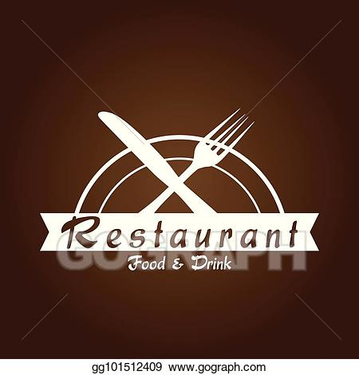
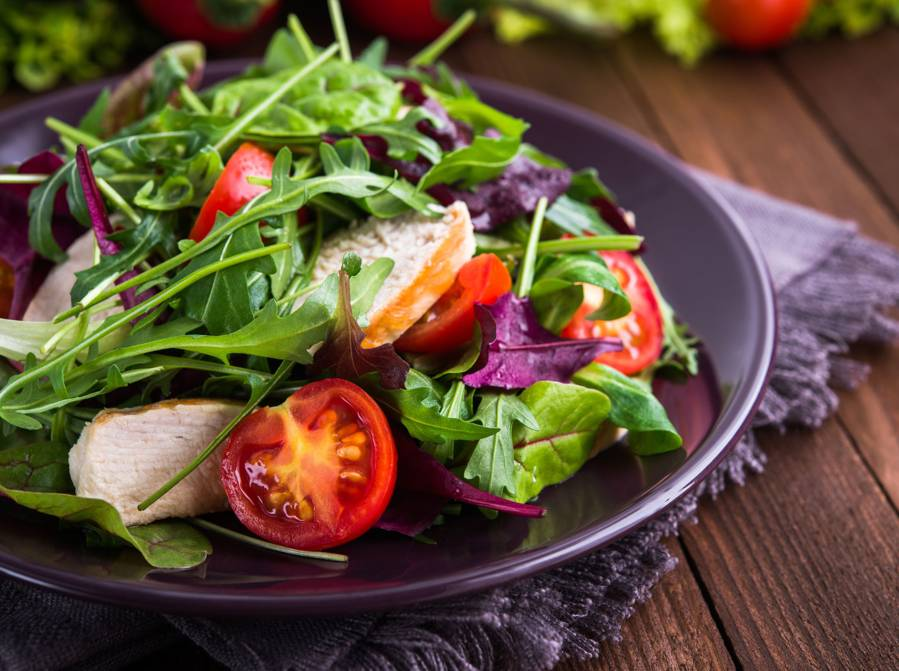
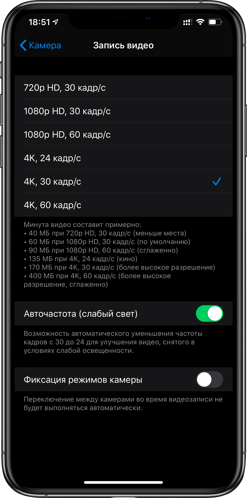

<!DOCTYPE html>
<html lang="en">

<head>
    <meta charset="UTF-8">
    <meta name="viewport" content="width=device-width, initial-scale=1.0">

    <link rel="stylesheet" href="resources/css/style.css">
    <link rel="stylesheet" href="vendors/css/normalize.css">
    <link rel="stylesheet" href="vendors/css/col.css">
    <link rel="stylesheet" href="vendors/css/4cols.css">
    <link rel="stylesheet" href="vendors/css/2cols.css">
    <link rel="stylesheet" href="vendors/css/3cols.css">
    <link href="https://fonts.googleapis.com/css?family=Lato:300,300i,400&display=swap" rel="stylesheet">
    
    <title>Omnifood</title>
</head>

<body>

    <header>
        <nav>
            

                
                <ul class="main-nav">
                    <li><a href="#">Food delivery</a></li>
                    <li><a href="#">How it works</a></li>
                    <li><a href="#">Our cities</a></li>
                    <li><a href="#">Sign up</a></li>

                </ul>
            

        </nav>

        

            <h1>Goodbye junk food.   Hello super healthy meals.</h1>
            <a class="btn btn-full" href="#">I'm hungry</a>
            <a class="btn btn-ghost" href="#">Show me more</a>
        

    </header>

    <section class="box-sec">
        

            <h2>Get food fast &mdash; not fast food</h2>
            

                Hello, we're Omnifood, your new preemium food service. We know you're always busy. No time for cooking.
                So let us take care of that, we're really good at it, we promise.
            

        

        

            

                <h3>Up to 365 days/year </h3>
                

                    Hello, we're Omnifood, your new preemium food service. We know you're always busy. No time for
                    cooking. So let us take care of that, we're really good at it, we promise.
                

            

        
        
            

                <h3>Ready in 20 minutes </h3>
                

                    Hello, we're Omnifood, your new preemium food service. We know you're always busy. No time for
                    cooking. So let us take care of that, we're really good at it, we promise.
                

            

    
        
            

                <h3>100% organic </h3>
                

                    Hello, we're Omnifood, your new preemium food service. We know you're always busy. No time for
                    cooking. So let us take care of that, we're really good at it, we promise.
                

            

        
        
            

                <h3>Order any time </h3>
                

                    Hello, we're Omnifood, your new preemium food service. We know you're always busy. No time for
                    cooking. So let us take care of that, we're really good at it, we promise.
                

            

        

    </section>
    <section class="section-meals box-sec">
        <ul class="meals-showccase clearfix">
            <li>
                <figure class="meal-photo">
                    
                </figure>
            </li>
            <li>
                <figure class="meal-photo ">
                    
                </figure>
            </li>
            <li>
                <figure class="meal-photo">
                    
                </figure>
            </li>
            <li>
                <figure class="meal-photo">
                    
                </figure>
            </li>
        </ul>
        <ul class="meals-showccase clearfix">
            <li>
                <figure class="meal-photo">
                    
                </figure>
            </li>
            <li>
                <figure class="meal-photo">
                    
                </figure>
            </li>
            <li>
                <figure class="meal-photo">
                    
                </figure>
            </li>
            <li>
                <figure class="meal-photo">
                    
                </figure>
            </li>
        </ul>

    </section>

    <section class="section-steps  box-sec">
        

            <h2>How it works &mdash; Simple as 1, 2, 3,</h2>
        

        

            

                
            

            

                

                    
1

                    

                        Choose the subscription plan that best fits your needs and sign up today.
                    

                

                

                    
2

                    

                        Choose the subscription plan that best fits your needs and sign up today.
                    

                

                

                    
3

                    

                        Choose the subscription plan that best fits your needs and sign up today.
                    

                

                
                

            

        

    </section>
    <section class="section-cities box-sec">
        

            <h2>We're currently in these cities</h2>
        

        

            

                
                <h3>Lisbon</h3>
                

                    <ion-icon name="person-circle-outline" size="small" class="clearfix"></ion-icon>
                    1600+ happy eaters
                

                

                    <ion-icon name="star-outline" size="small"></ion-icon>
                    60+ top chefs
                

                

                    <ion-icon name="logo-twitter" size="small"></ion-icon>

                    @comifood_lx
                

            

            

                
                <h3>San Francisco</h3>
                

                    <ion-icon name="person-circle-outline" size="small"></ion-icon>
                    1600+ happy eaters
                

                

                    <ion-icon name="star-outline" size="small"></ion-icon>
                    60+ top chefs
                

                

                    <ion-icon name="logo-twitter" size="small"></ion-icon>

                    @comifood_lx
                

            

            

                
                <h3>Lisbon</h3>
                

                    <ion-icon name="person-circle-outline" size="small"></ion-icon>
                    1600+ happy eaters
                

                

                    <ion-icon name="star-outline" size="small"></ion-icon>
                    60+ top chefs
                

                

                    <ion-icon name="logo-twitter" size="small"></ion-icon>

                    @comifood_lx
                

            

            

                
                <h3>Lisbon</h3>
                

                    <ion-icon name="person-circle-outline" size="small"></ion-icon>
                    1600+ happy eaters
                

                

                    <ion-icon name="star-outline" size="small"></ion-icon>
                    60+ top chefs
                

                

                    <ion-icon name="logo-twitter" size="small"></ion-icon>

                    @comifood_lx
                

            

        

    </section>

    <section class="section-testimonials">
        

            <h2>Our customers connot live without us.</h2>

        

        

            

                <blockquote>
                    Omnifood is just awesome! I just launched a startup which leaves me with no time for cooking, so
                    Omnifood is a life-sever. Now that I got used to it. I couldn't live without my daily meals!
                    <cite> Albert Duncan</cite>
                </blockquote>
            

            

                <blockquote>
                    Omnifood is just awesome! I just launched a startup which leaves me with no time for cooking, so
                    Omnifood is a life-sever. Now that I got used to it. I couldn't live without my daily meals!
                    <cite> Albert Duncan</cite>
                </blockquote>
            

            

                <blockquote>
                    Omnifood is just awesome! I just launched a startup which leaves me with no time for cooking, so
                    Omnifood is a life-sever. Now that I got used to it. I couldn't live without my daily meals!
                    <cite> Albert Duncan</cite>
                </blockquote>
            

        

    </section>

    
</body>

</html>